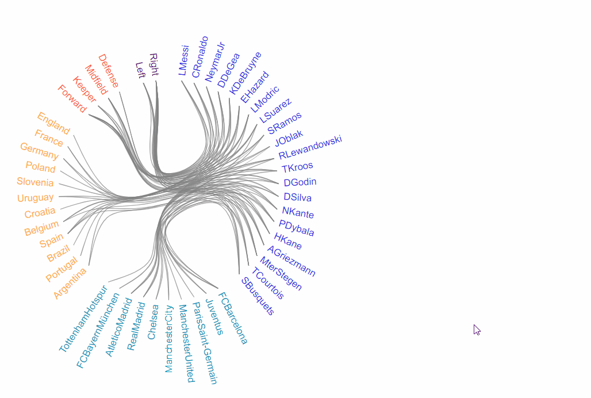

# FIFA19 Visualized

[Live Demo](https://davidcparkk.github.io/top20_fifa19/)

### Background and Overview
FIFA19 Visualized is an exploration of the D3.js library that gives users an instantaneous look at players details of the 20 top ranked football players in the world (according to [FIFA19 ratings](https://www.kaggle.com/karangadiya/fifa19)). An edge bundling hierarchy graph is used to link the class and nodetypes of attribute classes (i.e., counts, value of each player, wages, etc.). Hover over each node and see the interwoven relationships of each player, club, nation, and position.

## Technologies and Challenges

### Technologies Used

The project is built with a vanilla Javascript DOM manipulation, D3.js, HTML, CSS, and webpack. 



### Challenges

The main challenge that arose was implementing functions that highlights the node and links of each selected node. To get the desired effect, a mouseover listener calls a function on the data's imported values, then colors the imported values' source and target nodes. An example of the colorLinks function and invocation below.

```
.on("mouseover", function(d){
          d3.selectAll(".node").style("fill", "#e0e0e0");
          d3.selectAll(".link").style("stroke", "#e0e0e0");

          colorNode(d.data.name, d.data.nodeColor);
          d.data.imports.forEach(function(name){
            colorNode(name, d.data.nodeColor);
            colorLink(d.data.name, name, d.data.nodeColor);
          });

// break

function colorLink(src,tgt,color){
      let link_selections = d3.selectAll(".link");
      let link = link_selections.nodes().filter(function(d){
        return (d3.select(d).data()[0].source.data.name == src && d3.select(d).data()[0].target.data.name == tgt);
      });
```

Additionally, in order to display player details, raw data was loaded through a CSV file and populates a tooltip class (based on nodeType) that appears and disappears on mouseover events.

```
if (d.data.nodeType === 'player') {
            div.attr("class",`tooltip-player`);
            div.transition()		
              .duration(200)		
              .style("opacity", .9);

```

### Bonus Features for the Future
* Append a bar graph to the end of each node where bar length is representative of player value
